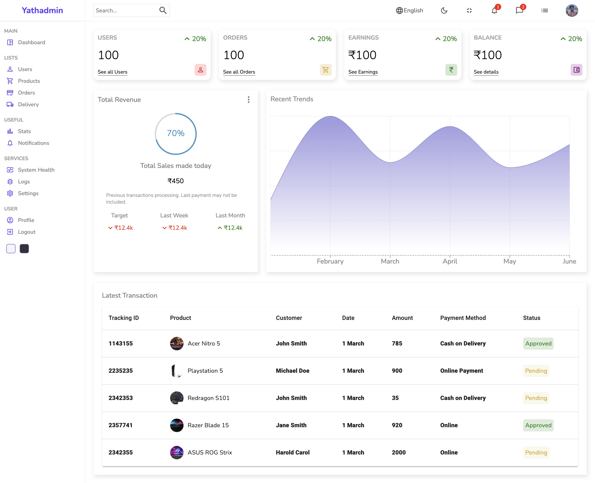
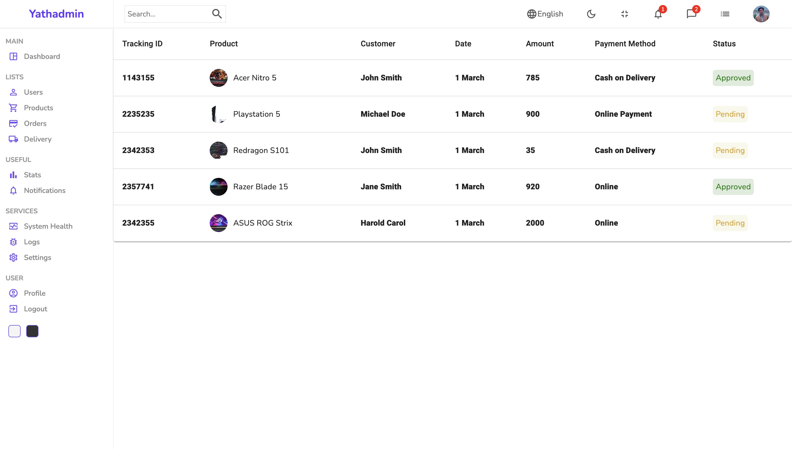
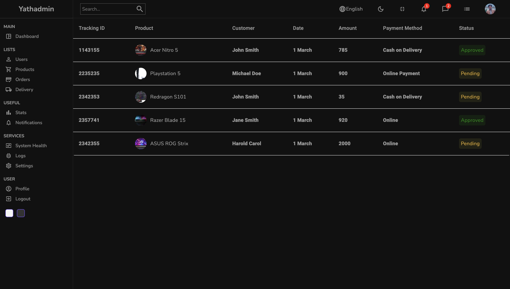
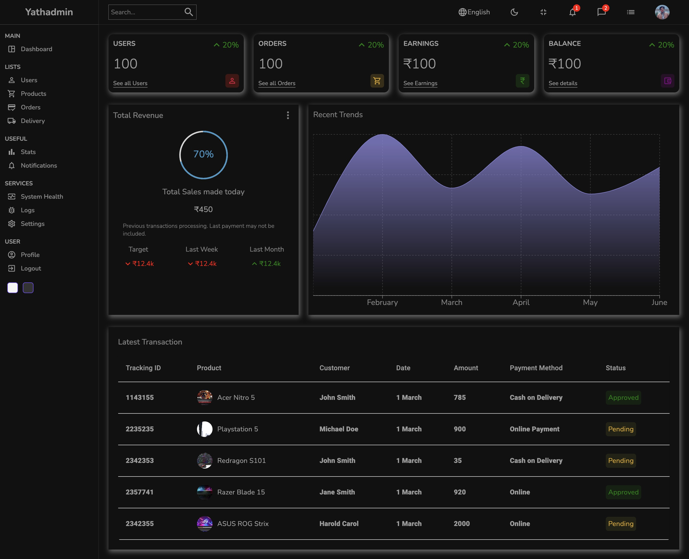

# React Admin User Interface (UI)

I'm excited to introduce my latest project—a sleek and modern **React Admin User Interface (UI)** that promises to elevate your application's data management experience! 🌐

## 📁 Project Overview

This Admin Panel is designed to make managing different aspects of your application a breeze, thanks to its intuitive interface. It simplifies data administration tasks and offers a seamless user experience.

## 🛠️ Tech Behind It

For this project, I've harnessed some pretty nifty tech tools:

- **React**: The core library for building the user interface, enabling dynamic and efficient component-based development.
- **React Router Dom**: Facilitates seamless navigation across different views and components in the application.
- **Material-UI**: Provides a set of React components that implement Google's Material Design, adding elegance with its beautiful icons and sleek tables.
- **SASS (Syntactically Awesome Style Sheets)**: A powerful CSS preprocessor that allows for more complex and maintainable styling, giving the UI a modern and visually pleasing look and feel.
- **JavaScript (ES6+)**: The programming language used for the development, leveraging modern JavaScript features for cleaner and more efficient code.
- **HTML5**: The markup language used to structure the application.
- **CSS3**: The style sheet language used for describing the presentation of the application.
- **Webpack**: A powerful module bundler for JavaScript, used to bundle the application assets.
- **Babel**: A JavaScript compiler that allows you to use next-generation JavaScript, today.
- **Axios**: A promise-based HTTP client for making API requests, used to fetch and manage data.

## 🌟 Key Features

- **📋 Clean Design**: Emphasis on a visually appealing and responsive design. It's not just about functionality; it's about making it easy on the eyes.
- **📊 Data Visualization**: Integrated charts for data representation, providing insights at a glance.
- **🔗 Simple Navigation**: Straightforward and intuitive navigation to ensure users won't get lost in the UI maze.
- **📦 User-Friendly Forms**: Simplified data input and management, making it easy for users to interact with.

## 🌐 Exploration and Feedback

If you're curious and want to take a closer look, you can explore the project:

- **Live Demo**: [Live Demo](https://lnkd.in/dFj32jrp)

## Screenshots

### Light Mode

### Dark Mode

---

Feel free to dive in, explore the features, and provide any feedback you might have. Happy coding!
